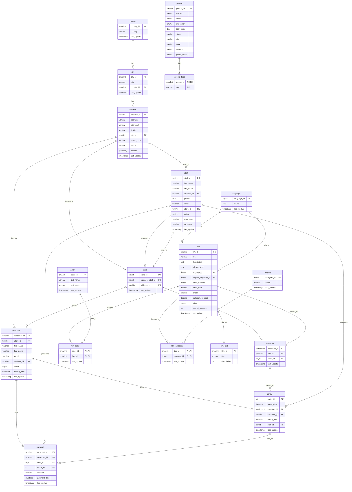

# Sakila Database ER Diagram

```mermaid
erDiagram
    %% Core entities
    country ||--o{ city : "has"
    city ||--o{ address : "has"
    address ||--o{ customer : "lives_at"
    address ||--o{ staff : "lives_at"
    address ||--o{ store : "located_at"

    store ||--o{ customer : "serves"
    store ||--o{ staff : "employs"
    store ||--o{ inventory : "stocks"
    staff ||--o| store : "manages"

    language ||--o{ film : "spoken_in"
    language ||--o{ film : "original"
    film ||--o{ film_actor : "features"
    film ||--o{ film_category : "belongs_to"
    film ||--o{ inventory : "stored_as"
    film ||--|| film_text : "has_text"

    actor ||--o{ film_actor : "acts_in"
    category ||--o{ film_category : "categorizes"

    customer ||--o{ rental : "rents"
    customer ||--o{ payment : "pays"
    inventory ||--o{ rental : "rented_as"
    staff ||--o{ rental : "processes"
    staff ||--o{ payment : "processes"
    rental ||--o{ payment : "paid_for"

    person ||--o{ favorite_food : "likes"

    %% Country
    country {
        smallint country_id PK
        varchar country
        timestamp last_update
    }

    %% City
    city {
        smallint city_id PK
        varchar city
        smallint country_id FK
        timestamp last_update
    }

    %% Address
    address {
        smallint address_id PK
        varchar address
        varchar address2
        varchar district
        smallint city_id FK
        varchar postal_code
        varchar phone
        geometry location
        timestamp last_update
    }

    %% Store
    store {
        tinyint store_id PK
        tinyint manager_staff_id FK
        smallint address_id FK
        timestamp last_update
    }

    %% Staff
    staff {
        tinyint staff_id PK
        varchar first_name
        varchar last_name
        smallint address_id FK
        blob picture
        varchar email
        tinyint store_id FK
        tinyint active
        varchar username
        varchar password
        timestamp last_update
    }

    %% Customer
    customer {
        smallint customer_id PK
        tinyint store_id FK
        varchar first_name
        varchar last_name
        varchar email
        smallint address_id FK
        tinyint active
        datetime create_date
        timestamp last_update
    }

    %% Language
    language {
        tinyint language_id PK
        char name
        timestamp last_update
    }

    %% Film
    film {
        smallint film_id PK
        varchar title
        text description
        year release_year
        tinyint language_id FK
        tinyint original_language_id FK
        tinyint rental_duration
        decimal rental_rate
        smallint length
        decimal replacement_cost
        enum rating
        set special_features
        timestamp last_update
    }

    %% Film Text
    film_text {
        smallint film_id PK
        varchar title
        text description
    }

    %% Actor
    actor {
        smallint actor_id PK
        varchar first_name
        varchar last_name
        timestamp last_update
    }

    %% Film Actor (Junction Table)
    film_actor {
        smallint actor_id PK,FK
        smallint film_id PK,FK
        timestamp last_update
    }

    %% Category
    category {
        tinyint category_id PK
        varchar name
        timestamp last_update
    }

    %% Film Category (Junction Table)
    film_category {
        smallint film_id PK,FK
        tinyint category_id PK,FK
        timestamp last_update
    }

    %% Inventory
    inventory {
        mediumint inventory_id PK
        smallint film_id FK
        tinyint store_id FK
        timestamp last_update
    }

    %% Rental
    rental {
        int rental_id PK
        datetime rental_date
        mediumint inventory_id FK
        smallint customer_id FK
        datetime return_date
        tinyint staff_id FK
        timestamp last_update
    }

    %% Payment
    payment {
        smallint payment_id PK
        smallint customer_id FK
        tinyint staff_id FK
        int rental_id FK
        decimal amount
        datetime payment_date
        timestamp last_update
    }

    %% Person
    person {
        smallint person_id PK
        varchar fname
        varchar lname
        enum eye_color
        date birth_date
        varchar street
        varchar city
        varchar state
        varchar country
        varchar postal_code
    }

    %% Favorite Food
    favorite_food {
        smallint person_id PK,FK
        varchar food PK
    }
```
